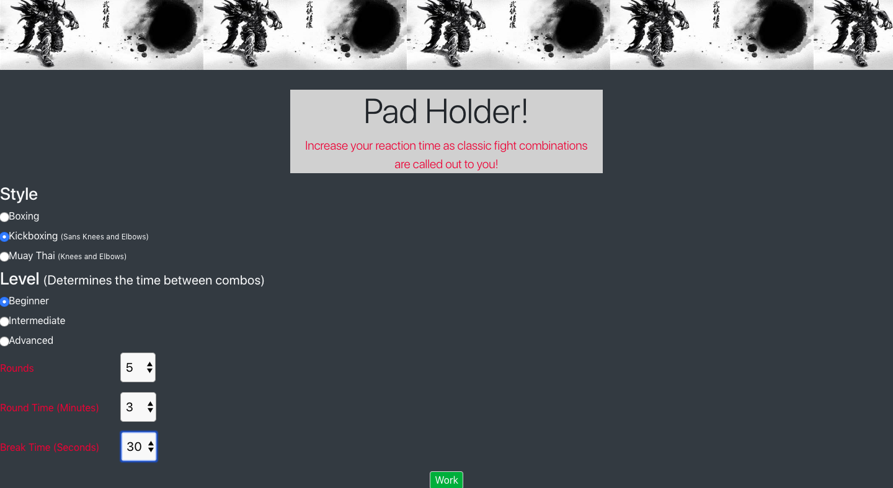
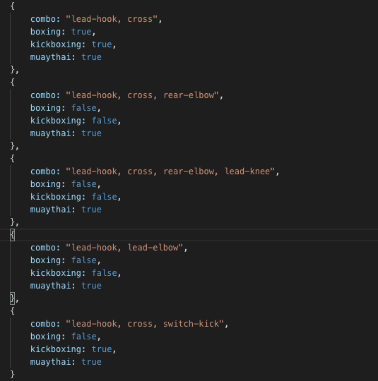
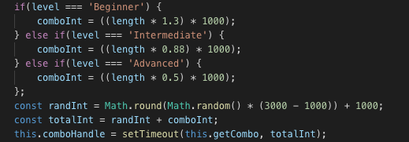
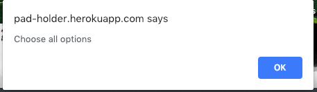
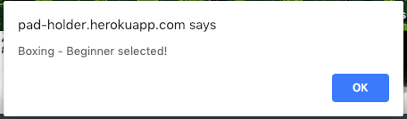
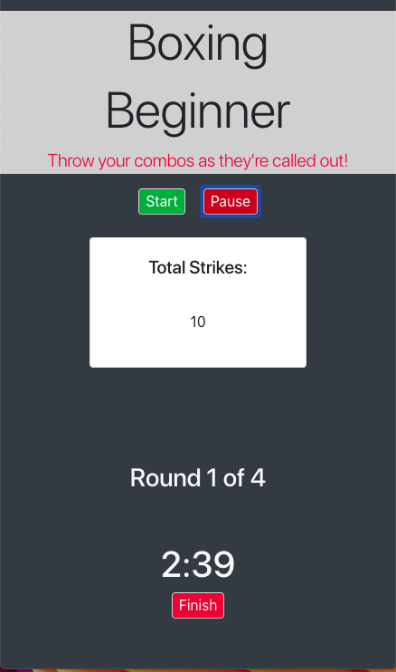
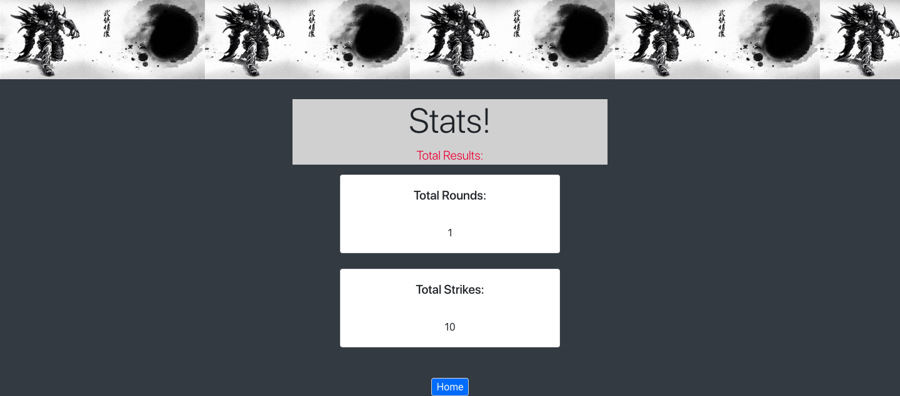
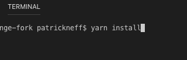
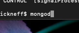
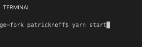

# Pad-Holder 
This is a mobile-first designed web application for Boxers, Kickboxers, MMA fighters, or anyone looking to increase their reaction time while doing bagwork or shadow boxing. There is no replacement for a great coach yet but the Pad-Holder app is the best attempt as a web application that creates some of a coach's characteristics. This application includes a round timer and uses speech synthesis to call out classic fight combinations during the rounds!

### The user selects between 3 styles of Martial Arts. This selection determines what kinds of strikes will be called out. For example: Boxing calls out punches only, Kickboxing calls out punches and kicks, while Muay Thai utilizes punches and kicks plus elbows and knee strikes.

### The user will also select their skill level. This selection determines the time between combinations called. This time is always random however the range is different for each skill level. 

### The user then selects how many rounds they'd like to train for, the length of those rounds, and whether they would like the break between rounds to be 30 or 60 seconds.
### The user cannot move on to the next page without choosing all of the options.

### The next page is the meat and potatoes of the application. This includes the actual round timer. Combinations are called out to the user during the rounds while total strikes thrown are added up and displayed.

### The user can either finish the entire workout they've selected or finish early if they've had enough. The application will then move on to their results page.

### This page displays how many rounds the user completed and how many total strikes were thrown

# Getting Started:
Since this is a MERN stack application you will need the correct technologies on your local machine.

## Prerequisites:
* MongoDB
* Express
* React
* NodeJS 

## Installation:
In command line- 'yarn install'

## To Run the Application and Test:
* Set up a database server by typing 'mongod' in terminal

* In a separate terminal shell type 'yarn start' to run the application

# Deployment:
I deployed this using Heroku in combination with mLab for database management

# Built With: 
* ReactJS - Front end frame work 
* MongoDB - Data storage 
* NodeJS - Server 
* Mongoose - MongoDB management and communication 
* Bootstrap - CSS library

# Contributing: 
Contact me directly if interested in contributing :)

# Author: 
Patrick Neff - Me

# Acknowledgments: 
Inspiration comes from all my fighter/martial artist friends and anytime I've had to do bagwork on my own (alot).

# Future Development:
As the speechsynthesisJS is currently an experimental technology I'm hoping there are some improvements given to it in the future. I tweaked the voice the best I could by speeding it up a bit but options are limited for now. I would like more voice options as well as increased speech intensity for the nature of this application.
